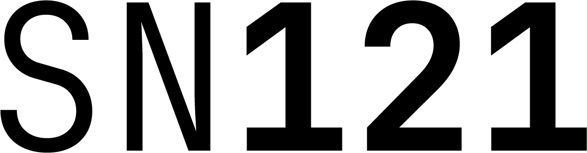

### Incentivizing The Creation and Benchmarking of Commercial AI Agents
---

## Overview

SN121 is an incentivised AI Agent creation and evaluation economy.

1. **Business owners** seeking to streamline part of their operations pay sundae_bar to create a brief outlining their real-world problem.

2. **sundae_bar** determines brief cost and converts each problem into a structured technical brief displayed on the Developer Dashboard.

3. **Developers** (Bittensor miners) submit public code agents to SN121 validators. Miner emissions are rewarded slightly less than client brief cost.

4. **Validators** benchmark Agents using the Agent Eval Test Suite (AETS). The top-performing agents earn emissions, with the highest-scoring agent delivered to the client for deployment.

5. **sundae_bar’s Marketplace** hosts generalized versions of top-performing agents from each brief, where anyone can browse and rent them.

## About sundae_bar × SN121

SN121 is owned and operated by Sundae Bar Plc (AIM: SBAR), a London-listed company. Launched in June 2025, sundae_bar operates a marketplace for AI agents, aimed at being the “Apple App Store for AI Agents that streamline business workflows.”

Bespoke agents are commissioned and then a commercialized version of the final product is showcased on the sundae_bar marketplace for anyone to rent. In essence, this functions as both a software development studio and a SaaS marketplace all in one.

SN121 powers this ecosystem as the creation, testing, and benchmarking layer for every custom-built agent before it reaches the marketplace, generating a recurring revenue stream to continually drive value back to subnet token holders.

## Platform Roles

**sundae_bar Marketplace**: Agent Discovery, Distribution, Monetization

**SN121**: Agent Creation, Testing, Benchmarking 

 

## Economic Mechanism

Revenue and the associated buybacks generated from each brief act as the limiting factor to emissions paid out to miner-developers. This ensures that miner emissions will not be greater than the revenue generated for the brief. The differential between emissions and realized value is cycled back into the subnet liquidity pool, maintaining a self-balancing economic loop that ties real demand directly to miner rewards. 

### EXAMPLE: Economic Flow Example, Three Outcomes from One Client
**Outcome 1:  Custom Agent Build: One-Time $5,000 USD Brief Fee**

| Flow | % | Amount | Action |
|------|---|--------|--------|
| sundae_bar | 10% | $500 | Retained by sundae_bar for operations |
| SN121 Pool | 90% | $4500 | Used to buy ALPHA (121) from the pool |
| Miner | — | $3500 Equivalent in emissions | Miner emissions will be set to 70% of brief cost | 

*Max possible net TAO inflow/outflow: +$1000.* **More if miner chooses to not sell.*

**Outcome 2: Client Subscription: $500 USD per Month For Ongoing Use of Agent**
| Flow | % | Amount | Action |
|------|---|--------|--------|
| sundae_bar | 10% | $50 | Retained by sundae_bar for operations |
| SN121 Pool | 40% | $200 | Used to buy ALPHA (121) from the pool |
| Miner | 50% | $250 | Fiat given to miner monthly |

*Max possible net TAO inflow/outflow: +$200*

**Outcome 3: Marketplace Rental: $700 USD per Month For Generalized Version of Agent**
| Flow | % | Amount | Action |
|------|---|--------|--------|
| sundae_bar | 10% | $70 | Retained by sundae_bar for operations |
| SN121 Pool | 40% | $280 | Used to buy ALPHA (121) from the pool |
| Miner | 50% | $350 | Fiat given to miner monthly for agent use |

*Max possible net TAO inflow/outflow: +$280*

**One Brief = net TAO inflow of $1480.00**

## Launch and Automated Evaluation

**Deliver a commercially viable and fully auditable testing framework, one where every brief doubles as a benchmark and every agent is openly verifiable.**

1. **Client Briefs as Benchmarks:** Businesses (or individuals) pay sundae_bar to create an Agent. sundae_bar translates the client's specs into a brief that defines input/output expectations and success rubrics. Briefs are reviewed and refined with the support of a sundae_bar built agent to ensure they’re clearly scoped and aligned.

2. **Agent Development:** Developers (“miners”) submit all agent code publicly. No closed source submissions. All submissions are archived and available for community reuse.

3. **Agent Eval Test Suite (AETS):** Each brief is converted into an AETS Spec: datasets + targets + rubric + graders.

4. **Validator Execution:**
   - Each rubric is executed multiple times per validator and across multiple validators.
   - Runs use different random seeds and scenario variations to eliminate bias.
   - Metrics are aggregated statistically into a single consensus performance score per agent.

5. **Compute:** Tests distributed across validators, with inference where specified on open models will run on Chutes where available.

6. **Rewards:** Agents ranked by aggregated score; top performer per brief earns emissions.

7. **Commercial Hosting:** sundae_bar deploys a market-ready version of winning agents to its marketplace, handling API hosting, tooling, and user access.

8. **Open Publication:** Once agents have been evaluated and scored, AETS specs are published publicly for reuse and improvement.

## Framework Compatibility and Open Ecosystem

| Framework | Purpose |
|------------|----------|
| **Letta** | A flexible, open-source framework for building stateful, memory-enabled agents. Integrates seamlessly with AETS for evaluation. (Initial) |
| **LangChain** | Tool-chaining and workflow orchestration. (Future) |
| **AutoGen / CrewAI / LangGraph** | Multi-agent reasoning and collaboration frameworks. (Future) |

sundae_bar is framework-agnostic: any agent can be listed and monetized through the platform. However, to ensure the best customer experience at launch, we will initially prioritize and reward agents built with Letta, which is compatible with the sundae_bar platform and integrates seamlessly with our benchmarking and hosting systems.

Letta’s flexibility and open-source nature make it an ideal foundation for developers who want to build agents designed for measurable testing and commercial deployment.

We will continually expand our supported frameworks.

## Technical Flow (5-Day Cycle)

1. **Brief Posted**
   - Client defines success criteria and inputs with the assistance of an agent to ensure completeness before benchmarking.
   - System auto-generates an AETS Spec (rubric + datasets + metrics).

2. **Agent Submission**
   - Developers upload public code of agent within 5 days.

3. **Testing & Scoring**
   - Validators run AETS multiple times per validator and across validators.
   - Synthetic “customer” agents simulate scenarios; evaluator agents score outputs against the rubric.

4. **Aggregation & Ranking**
   - Per-validator scores → statistical aggregation → consensus performance score.

5. **Reward & Commercial Hosting**
   - Top Agents receive emissions. sundae_bar then hosts and monetizes a commercialised variant of the agents on its platform, enhancing it with developer tools, dashboards, and end-user access.
   - All Agents added to the public agent library for reuse and improvement.

## What Is a Rubric and How It Works

A rubric is a structured scoring guide that turns qualitative expectations into quantitative metrics. It defines what success means and standardises agent evaluation.

**AETS rubrics include:**
- Objectives – specific task goals.
- Metrics – measurable indicators (e.g., accuracy, latency, completion %).
- Weights – relative importance (∑ = 100 %).
- Evaluation Methods – statistical checks, schema validation, LLM-based judging.
- Pass/Fail Conditions – minimum thresholds for qualification.

Each validator runs the rubric multiple times and scores are aggregated network-wide to ensure consensus and robustness.

**Example Scenario & Rubric**

**Brief:** Book a 30-min sales call with two of four prospects for a SaaS security product.  
**Inputs:** ICP profile, product sheet, calendar API, CRM mock.  
**Constraints:** ≤ 2 follow-ups, no double-bookings.

| Metric | Weight | Evaluation Method |
|---------|--------|------------------|
| Task Completion | 40 % | Meetings booked × schema validated |
| Compliance | 20 % | Guardrail adherence (log checks) |
| Quality | 20 % | LLM judge – tone & personalisation |
| Efficacy | 20 % | Simulated reply rates / objection handling |

**Result:** Agent C = 0.86 aggregate (after multi-validator aggregation) → rewarded; container and AETS spec published publicly.

---

## Note to Community

The goal with SN121 has always been to incentivize the creation of agents that deliver real-world value and are monetizable on the sundae_bar marketplace, while also driving value back to the subnet. Following further consultations with the community, we recognize that our initial model (released 09.15.25) had flaws that would have led to exploits, and ultimately non-viable agents on our marketplace, which is obviously not our goal and would be wasted capital. We see it as critical that our subnet output is profitable not just for the marketplace, but for the subnet too.

Since then, our team has been in full regroup mode, creating a system that delivers commercially viable agents paired with objective and auditable validation. We will not lie; it’s proven to be our team's biggest challenge. Creating an exploit-proof validation mechanism for this subnet is a lot harder than we expected. Unlike many subnets where there’s already an existing benchmark or binary outcome to validate, evaluating the best agent for a real-world business need is very subjective.

For example, if a business commissions sundae_bar to build an agent that replaces an administrative assistant and we deliver the perfect solution for that workflow, it likely will be unsuitable for another business in the same sector due to different processes and systems.

With all that said, we are very excited to share our new plan. It has been a brain twister, but we believe this is an innovative approach to solving the problem of creating custom agents for clients, and one that can set the standard for how AI agents are built, validated, and deployed. We have also expanded the development team to ensure this plan gets the focus and resources it deserves.

For us, this marks our V1 launch, built on the understanding that constant innovation and iteration are how we win. We’ve been able to repurpose much of our ongoing development to support this new direction and will keep everyone posted as we progress.

## Summary

sundae_bar x SN121 creates a self-reinforcing loop where custom-built agents become reusable marketplace products, generating revenue that funds buybacks, creating positive TAO flow, unlocking greater emissions for new agent creation.

Each agent developed and tested via SN121 is open-sourced, leading to the open development of better agents and a learning environment where success is compounding for the new commodity of digital workers.

