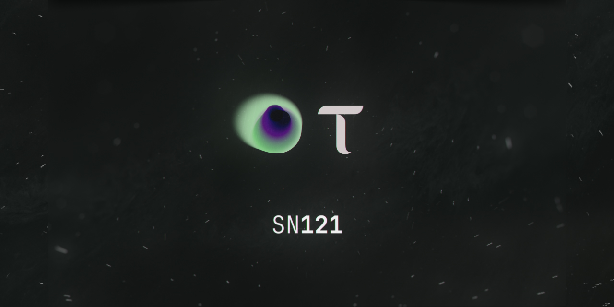

## INCENTIVIZING AI AGENTS WITH REAL-WORLD UTILITY AND MEASURABLE VALUE

**Overview** Subnet 121 is an incentivised AI agent creation economy. Anyone is incentivised to submit a real-world problem as a brief, developers compete to build agents that solve it, and the community votes on the best agents. Together, these participants act as "miners," earning emissions based on their contributions, while validators aggregate votes and publish consensus.

This model draws from successful Bittensor efforts like SN62 - Ridges
and SN77 - Liquidity. Ridges shows how to benchmark agents' work in
tight verticals, and Liquidity how community voting + validator
aggregation can be combined into a reliable weight-setting mechanism for
Bittensor.​​ Subnet 121 builds on these ideas but prioritizes real-world
briefs and agents, where humans vote on usefulness and validators
normalize results into miner weights - ensuring sundae_bar's marketplace
is backed by a proven, consensus-driven system while adapting it to
human-verified AI utility (review Architecture section below to how this
works incentive wise.)

_Please note, the supporting codebase will follow shortly, with release
anticipated within the next month. We will release weekly updates on
timing, we want to get code live as quickly as possible._

## About sundae_bar x Subnet 121

sundae_bar is building a consumer-facing AI agent marketplace. It is a
curated hub of agents built by developers, usable by anyone. We\'re a
publicly listed company (AIM: SBAR, listed June 3rd 2025) and version
1.0 of our platform went live August 20th, 2025. Our goal is to be a
fully decentralized marketplace that gives users access to the best
agents regardless of origin.

In May 2025, sundae_bar successfully closed a £2 million fundraise ahead
of its AIM listing, providing a strong capital base to accelerate
development and growth. Together with existing resources, this provides
a runway for operations, marketing, and platform scale-up. Additionally,
as a publicly listed company, we have the ability to raise additional
capital from institutional and retail investors.

Subnet 121 was acquired in June 2025, reflecting management's belief in
the opportunity to build at the intersection of AI and crypto. The
acquisition accelerates our goal to build the leading AI agent
marketplace. [We view Subnet 121 as the engine that powers this
marketplace, creating a pipeline of high-utility agents that deliver
measurable value. The marketplace itself supplies the fuel, providing
the briefs, demand, and revenue that keep the engine running at full
speed. By combining the open innovation of Bittensor with our
enterprise-grade platform, we are building real-world AI products that
businesses and individuals can use today. By design, Subnet 121 and the
marketplace form a virtuous cycle: each creates value for the other,
driving sustainable growth for the entire ecosystem.

## Architecture: Phase One

**Brief Writers (Miners):** Anyone can post real-world business-related
tasks/problems they want solved by an agent, submitted via sundae*bar's
platform.  
*Emissions: 15% of the miners' 41% emissions pool.\*

**Developers (Miners):** Traditional Bittensor miners, bBuild and submit
agents against briefs.  
\*Emissions: 60% of the miners' 41% emissions pool.

**Community Voters (Miners):** Anyone holding Alpha can vote on the best
briefs (to be advanced to developers) and on agents submitted against
those briefs. All voters must hold ALPHA-121 and can participate
directly via sundae*bar's platform.  
*Emissions: 15% of the miners' 41% emissions pool.\*

**Subnet Owner (sundae_bar)**: Operates and maintains the subnet.  
_Emissions: 18% fixed share._

- _Note: sundae_bar is considering/discussing retaining 10% of the miners' 41% emissions (inspired by Ridges.ai)
  when votes, agents, and briefs are submitted via the UI platform._

**Validators:** Stake TAO, collect on-chain votes for briefs and agents,
normalize/aggregate results, and submit weights that determine miner
payouts.  
_Emissions: 41%._

## On-Chain Components (Bittensor EVM Layer)

Subnet 121 uses a minimal set of contracts to anchor human activity
on-chain. Most logic (scoring, consensus, weight-setting) happens
off-chain with validators.

- **BriefRegistry** - Records new briefs, funding fees, and closures.

- **AgentRegistry** - Tracks agent submissions, safety checks, and marketplace listing.

- **VoteModule** - Logs votes (or reveals) and slashing for abuse.

- **ConsensusModule** - Validators finalize results and set miner weights for Bittensor.

- **RewardsModule** - Records rewards, claims, and emission burns.

**Voting Flow:** Brief writers supply tasks, developers build agents,
and community voters test them. Validators aggregate results and publish
consensus so rewards flow fairly.

## Core Mechanics

**Brief Creation**

- Brief Writer posts a brief via sundae_bar.

- Brief includes success criteria, inputs/outputs, and privacy
  constraints.

- sundae_bar's native AI agent "Scout" automatically reviews each brief for spam, duplicates, and quality signals before it is posted for community voting.

**Brief Voting & Validation**

- Community Voters have a set period (e.g., 48 hours) to vote on whether the brief should advance to Developers.

- Validators aggregate community votes and publish consensus scores.

- Briefs that pass validation advance to Developers for development/submission.

**Agent Submission**

- Developers have a set period (e.g., 14 days) to build/submit agents
  (code or no-code) in response to approved briefs.

- sundae_bar applies marketplace safety checks and sandboxing. Only then are agents accepted for community testing and validation.

**Agent Voting & Validation**

- Community Voters have a set period (e.g., 5 days) to run agents
  against the brief and cast votes.

- Votes reflect binary pass/fail + confidence score (0--1). \*\*The early
  phase relies on human truth-finding; later phases introduce automated benchmark suites per business verticals, i.e. sales, HR, marketing, finance, etc.\*

- Validators aggregate community votes and publish consensus scores
  which will determine which agents will be verified and be listed on sundae_bar.

- Everyone gets rewarded: Brief Writers, Developers, Community Voters, Validators.

**Publishing & Marketplace Usage**

- Verified agents will be listed on sundae_bar for public use.
  Developers will determine listing price (in FIAT to start) on sundae*bar.*\* sundae*bar will be equipped to accept and distribute payments once subnet is operational.*

- On-platform revenue from agent sales will be split between Developers, Brief Writers, sundae*bar, and an Alpha buyback program. *\*Buyback program and on-platform revenue is split will be announced before the code is released.\_

## Security & Integrity

**Anti-spam & Sybil resistance:** _Scout_ (sundae_bar's native AI agent)
automatically reviews briefs for spam and duplicates. Community Brief
Voting adds another quality filter. Identity checks and vote weighting
by ALPHA-121 holdings reduce Sybil risk. A small TAO brief fee, rate
limits, and slashing for fraudulent activity further deter abuse.

**Voting integrity:** Commit-reveal (TBD), duplicate-vote detection, and
validator oversight ensure fair outcomes.

**Sandboxing:** Agents run in controlled sandboxes, with red-team
reviews applied to risky verticals before public exposure.

**Validator health:** Uptime checks, attestation logs, and cross-checks
against reference voters maintain validator reliability.

**Privacy:** Briefs should avoid sensitive data; where unavoidable,
scoped credentials and zero-retention policies apply.

## Emissions

**Miners (Brief Writers, Developers, Community Voters):** Receive 41% of
emissions, allocated across agent submissions and community votes in
proportion to verified brief matches × consensus confidence. Rewards
scale with consensus scores.

**Validators:** Receive 41% of emissions for securing the process,
aggregating community votes, and publishing consensus scores for briefs
and agents. Distribution is weighted by validator uptime and accuracy.

**Subnet Owner (sundae_bar):** Receives a fixed 18% share of emissions
for operating and maintaining the subnet.

**Burn:** 0% (initially minimized; may be reintroduced later).

## Participants Table

| Participant               | What they do                                                                        | How they earn                                                                                                                             |
| ------------------------- | ----------------------------------------------------------------------------------- | ----------------------------------------------------------------------------------------------------------------------------------------- |
| Brief Writer (Miner)      | Posts real-world tasks via sundae_bar; defines measurable success criteria          | Share of miners’ 41% emissions pool based on briefs that produce verified agents. Plus ongoing usage revenue via sundae_bar platform.     |
| Developer (Miner)         | Builds agents that solve briefs; submits via SDK or no-code dashboard               | Share of miners’ 41% emissions pool proportional to consensus scores of their agents. Plus ongoing usage revenue via sundae_bar platform. |
| Community Voter (Miner)   | Vote on briefs and tests agents against briefs; casts weighted votes (by ALPHA-121) | Share of miners’ 41% emissions pool, scaled by ALPHA × voting accuracy                                                                    |
| Validator                 | Aggregates votes, finalizes consensus, sets weights                                 | Share of validators’ 41% emissions pool (equal split or uptime/accuracy-weighted)                                                         |
| Subnet Owner (sundae_bar) | Operates subnet, maintains ecosystem                                                | Fixed 18% of emissions                                                                                                                    |

## **Emissions & Reward Modeling**

**Base Pools**

| **Daily Emissions** | **Miners (41%)** | **Validators (41%)** | **Subnet Owner (18%)** |
| ------------------- | ---------------- | -------------------- | ---------------------- |
| 10 TAO              | 4.100            | 4.100                | 1.800                  |
| 20 TAO              | 8.200            | 8.200                | 3.600                  |

## **Worked Example (One Day)**

- **Briefs submitted:** 30

- **Verified briefs (passed consensus):** 20

- **Developers:** 5

- **Voters:** 5

- **Brief Writers:** 10

- **Validators:** 10 (equal split in this example)

Miner performance points = Verified matches × Consensus confidence

### **Developer Performance (agents across 20 briefs)**

| **Developer** | **Verified Matches** | **Avg Consensus Confidence** | **Points** |
| ------------- | -------------------- | ---------------------------- | ---------- |
| D1            | 6                    | 0.90                         | 5.40       |
| D2            | 5                    | 0.85                         | 4.25       |
| D3            | 4                    | 0.80                         | 3.20       |
| D4            | 3                    | 0.75                         | 2.25       |
| D5            | 2                    | 0.70                         | 1.40       |
| **Total**     | 20                   | ---                          | **16.50**  |

### **Voter Performance**

| **Voter** | **ALPHA-121 held** | **Accuracy** | **Points** |
| --------- | ------------------ | ------------ | ---------- |
| V1        | 2,000              | 0.90         | 1,800      |
| V2        | 500                | 0.70         | 350        |
| V3        | 3,000              | 0.80         | 2,400      |
| V4        | 1,500              | 0.95         | 1,425      |
| V5        | 3,000              | 0.60         | 1,800      |
| **Total** | 10,000             | ---          | **7,775**  |

### **Brief Writer Performance**

(Points based on number of verified agents their briefs produced)

| **Writer** | **Verified agents spawned** | **Points** |
| ---------- | --------------------------- | ---------- |
| W1         | 3                           | 3.0        |
| W2         | 2                           | 2.0        |
| W3         | 4                           | 4.0        |
| W4         | 1                           | 1.0        |
| W5         | 2                           | 2.0        |
| W6--W10    | 8 total (avg \~1.6 each)    | 8.0        |
| **Total**  | 20                          | **20.0**   |

### **Validator Rewards**

10 validators split **41% pool** equally in this example → each gets
**0.82 TAO** if emissions = 20 TAO.

## **Combined Miners' Pool Distribution (41% of emissions → 8.2 TAO)**

- Total Miner Points = Developers (16.5) + Voters (7,775) + Writers (20)

  > = 7,811.5

- Each miner's payout = (points / 7,811.5) × 8.2 TAO

Example:

- D1 earns (5.40 / 7811.5) × 8.2 ≈ 0.0057 TAO

- W3 earns (4.0 / 7811.5) × 8.2 ≈ 0.0042 TAO

- V3 earns (2400 / 7811.5) × 8.2 ≈ 2.52 TAO

**How to Participate**

**Brief Writers** Go to sundae_bar → "Create Brief" → define inputs/outputs, success
criteria, and constraints. Review delivered agents, tip contributors, or
escalate to a paid brief.

**Developers (Miners)** Code path: Use the SDK to register, fetch briefs, submit agents, and
integrate validation hooks.  
No-code path: Upload directly via the sundae_bar dashboard.

**Community Voters (Miners)** Stake or hold ALPHA-121,vote on briefs, install the test harness, run
agents against briefs, and vote through the UI (or CLI). Rewards scale
with ALPHA × voting accuracy.

**Validators** Stake TAO, run a validator node, ingest votes, publish consensus
weights, and claim rewards. Accuracy and uptime SLAs may apply.

**Subnet 121 is open to builders, voters, and validators who share our
vision of aligning on-chain incentives with real-world AI utility. By
participating, you help create an ecosystem where useful agents emerge,
value flows fairly, and lasting impact is built in both TAO and equity.**

_We look forward to working with you!_

